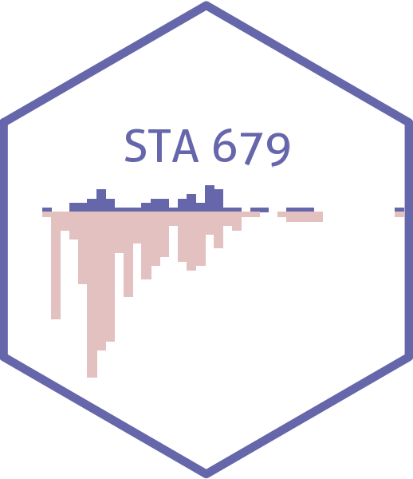

# Causal Inference {.unnumbered}

This is the homepage for STA 379/679 - Causal Inference taught by [Dr. Lucy D'Agostino McGowan](http://lucymcgowan.com/) in Spring 2022 at Wake Forest University.
All course materials will be posted on this site.

`<svg aria-hidden="true" role="img" viewBox="0 0 512 512" style="height:1em;width:1em;vertical-align:-0.125em;margin-left:auto;margin-right:auto;font-size:inherit;fill:currentColor;overflow:visible;position:relative;"><path d="M256,8C119,8,8,119,8,256S119,504,256,504,504,393,504,256,393,8,256,8Zm92.49,313h0l-20,25a16,16,0,0,1-22.49,2.5h0l-67-49.72a40,40,0,0,1-15-31.23V112a16,16,0,0,1,16-16h32a16,16,0,0,1,16,16V256l58,42.5A16,16,0,0,1,348.49,321Z"/></svg>`{=html} Class meets on Mondays and Wednesdays, 11:00 - 12:15.

`<svg aria-hidden="true" role="img" viewBox="0 0 512 512" style="height:1em;width:1em;vertical-align:-0.125em;margin-left:auto;margin-right:auto;font-size:inherit;fill:currentColor;overflow:visible;position:relative;"><path d="M80 368H16a16 16 0 0 0-16 16v64a16 16 0 0 0 16 16h64a16 16 0 0 0 16-16v-64a16 16 0 0 0-16-16zm0-320H16A16 16 0 0 0 0 64v64a16 16 0 0 0 16 16h64a16 16 0 0 0 16-16V64a16 16 0 0 0-16-16zm0 160H16a16 16 0 0 0-16 16v64a16 16 0 0 0 16 16h64a16 16 0 0 0 16-16v-64a16 16 0 0 0-16-16zm416 176H176a16 16 0 0 0-16 16v32a16 16 0 0 0 16 16h320a16 16 0 0 0 16-16v-32a16 16 0 0 0-16-16zm0-320H176a16 16 0 0 0-16 16v32a16 16 0 0 0 16 16h320a16 16 0 0 0 16-16V80a16 16 0 0 0-16-16zm0 160H176a16 16 0 0 0-16 16v32a16 16 0 0 0 16 16h320a16 16 0 0 0 16-16v-32a16 16 0 0 0-16-16z"/></svg>`{=html} [Course syllabus](https://www.vizdata.org/syllabus.html) 

`<svg aria-hidden="true" role="img" viewBox="0 0 448 512" style="height:1em;width:0.88em;vertical-align:-0.125em;margin-left:auto;margin-right:auto;font-size:inherit;fill:currentColor;overflow:visible;position:relative;"><path d="M12 192h424c6.6 0 12 5.4 12 12v260c0 26.5-21.5 48-48 48H48c-26.5 0-48-21.5-48-48V204c0-6.6 5.4-12 12-12zm436-44v-36c0-26.5-21.5-48-48-48h-48V12c0-6.6-5.4-12-12-12h-40c-6.6 0-12 5.4-12 12v52H160V12c0-6.6-5.4-12-12-12h-40c-6.6 0-12 5.4-12 12v52H48C21.5 64 0 85.5 0 112v36c0 6.6 5.4 12 12 12h424c6.6 0 12-5.4 12-12z"/></svg>`{=html} [Course schedule](https://www.vizdata.org/schedule.html).

 

## Contact information {.unnumbered}

     |      |     |     
------------------|-------------------|------------------|------------------
Instructor        | [Lucy D'Agostino McGowan](http://lucymcgowan.com) | <a href="mailto:mcgowald@wfu.edu" title="email"><i class="fa fa-envelope"></i></a> &nbsp; <a href="https://github.com/LucyMcGowan" title="GitHub"><i class="fa fa-github"></i></a> &nbsp; <a href="https://twitter.com/LucyStats" title="Twitter"><i class="fa fa-twitter"></i></a> 
 Outside help                 | [Math & Stats Center](https://mathandstatscenter.wfu.edu/) | <a href="mailto:mathandstatscenter@wfu.edu" title="email"><i class="fa fa-envelope"></i></a> &nbsp; | 
                  
 

## License {.unnumbered}

 This online work is licensed under a <a rel="license" href="https://creativecommons.org/licenses/by-sa/4.0/">Creative Commons Attribution-ShareAlike 4.0 International</a>.

## About this website {.unnumbered}

This website is built with the [bookdown](https://bookdown.org/yihui/bookdown/) R package. It was adapted based on www.vizdata.org by [Mine Çetinkaya-Rundel](https://mine-cr.com).
