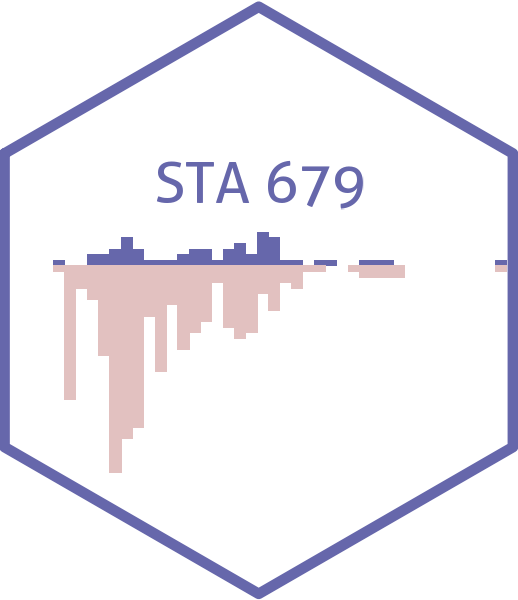

# Causal Inference {.unnumbered}

This is the homepage for STA 379/679 - Causal Inference taught by [Dr. Lucy D'Agostino McGowan](http://lucymcgowan.com/) in Spring 2022 at Wake Forest University.
All course materials will be posted on this site.

`r fontawesome::fa("clock")`  Class meets on Mondays and Wednesdays, 11:00 - 12:15.
`r fontawesome::fa("clock")`  Office hours: Tuesday 10a-11a, 1p-2p

`r fontawesome::fa("list")`  [Course syllabus](https://sta-679-s22.netlify.app/syllabus.html) 

`r fontawesome::fa("calendar")`  [Course schedule](https://sta-679-s22.netlify.app/schedule.html).

 

## Contact information {.unnumbered}

     |      |     |     
------------------|-------------------|------------------|------------------
Instructor        | [Lucy D'Agostino McGowan](http://lucymcgowan.com) | <a href="mailto:mcgowald@wfu.edu" title="email"><i class="fa fa-envelope"></i></a> &nbsp; <a href="https://github.com/LucyMcGowan" title="GitHub"><i class="fa fa-github"></i></a> &nbsp; <a href="https://twitter.com/LucyStats" title="Twitter"><i class="fa fa-twitter"></i></a> 
 Outside help                 | [Math & Stats Center](https://mathandstatscenter.wfu.edu/) | <a href="mailto:mathandstatscenter@wfu.edu" title="email"><i class="fa fa-envelope"></i></a> &nbsp; | 
                  
 

## License {.unnumbered}

 This online work is licensed under a <a rel="license" href="https://creativecommons.org/licenses/by-sa/4.0/">Creative Commons Attribution-ShareAlike 4.0 International</a>.

## About this website {.unnumbered}

This website is built with the [bookdown](https://bookdown.org/yihui/bookdown/) R package. It was adapted based on www.vizdata.org by [Mine Çetinkaya-Rundel](https://mine-cr.com).
